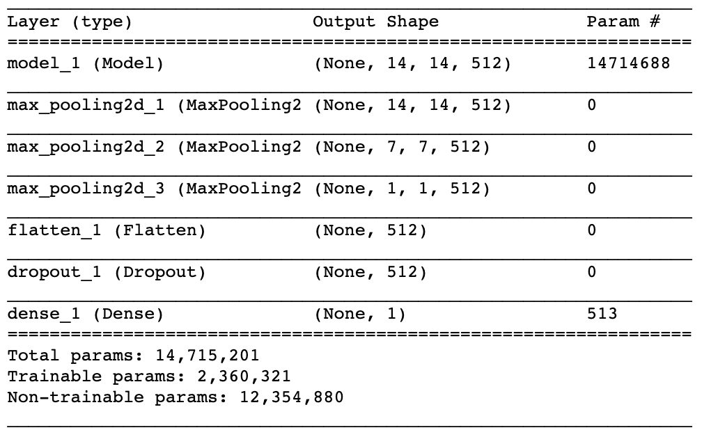

```{r echo = FALSE}
library(kableExtra)
```


## Introduction

Chest X-ray exams are one of the most frequent and cost-effective types of medical imaging examinations. Deriving clinical diagnoses from chest X-rays can be challenging, however, even by skilled radiologists. When it comes to pneumonia, chest X-rays are the best available method for diagnosis. More than 1 million adults are hospitalized with pneumonia and around 50,000 die from the disease every year in the United States alone. The high prevalence of pneumonia makes it a good candidate for the development of a deep learning application. The diagnosis of pneumonia from chest X-rays is difficult for several reasons: the appearance of pneumonia in a chest X-ray can be very vague depending on the stage of the infection, pneumonia often overlaps with other diagnoses, and pneumonia can mimic benign abnormalities. For these reasons X-CAM is introduced.


## Intended Use and Indications for Use

The intended use for X-CAM is to aid radiologists in visualizing the prevalence of pneumonia in chest X-rays. An example output of the algorithm can be seen in **Figure 1**. X-CAM's indications for use is for chest X-rays with a posterior-anterior (PA) or an anterior-posterior (AP) view position of male and female hospital patients between 9 and 81 years of age who are believed to have pneumonia. 

X-CAM is not recommended for patients under the age of 9 or over the age of 81 who are believed to not have pneumonia and for images that are not chest X-rays taken from the posterior-anterior (PA) or an anterior-posterior (AP) view position. Common comorbidities with pneumonia include infiltration, edema, effusion, and atelectasis. X-CAM's output for cases that have been diagnosed with the aforementioned comorbidities can be less reliable than for cases that are absent of the aforementioned comorbidities.

The performance of X-CAM is based on a balance between the false positive rate (FP) and false negative rate (FN) for pneumonia identification in chest X-rays. FN (used to calculate recall) is best leveraged for ruling out the identification of pneumonia while FP (used to calculate precision) is best leveraged for confirming the identification of pneumonia. By having a balance between these two metrics X-CAM optimizes its potential aid to radiologists in visualizing the prevalence of pneumonia in chest X-rays.

```{r, echo = FALSE, out.width = "90%", fig.cap = "CAM Heatmap", fig.align = "center"}


```


## Dicom Validation and Preprocessing

The process to validate a dicom file involves ensuring the following from the dicom header: the patient position is either PA (posterior-anterior) or AP (anterior-posterior), the modality used is DX (X-ray), and the body part examined is the chest (CHEST). If a dicom file input fails to fulfill these requirements the output will be a message indicating an invalid input accompanied by the metadata the invalid dicom file has for view position, modality, and body part examined. 

```{r, echo = FALSE, out.width = "100%", fig.cap = "Algorithm Flowchart", fig.align = "center"}


```

The steps to preprocess the dicom pixel array representation for an X-ray begins with normalizing pixel intensity values to a decimal ranging between 0 and 1. Next, the normalized pixel intensity values are standardized by subtracting a mean and then dividing that result by a standard deviation. The mean and standard deviation used is the **ImageNet**^[https://www.image-net.org/] mean and standard deviation, which is converted to grayscale using the **$Y_{LINEAR}$**^[https://en.wikipedia.org/wiki/Grayscale] method. 

$$
Y_{linear} = 0.2126\bar R_I + 0.7152\bar G_I + 0.0722\bar B_I
$$

The reason for this standardization is because X-CAM leverages pre-trained weights derived from a Convolutional Neural Network (CNN) called **VGG-16**^[https://arxiv.org/pdf/1409.1556.pdf], which had been trained on the ImageNet data set. The final preprocessing step is to resize the dicom pixel array representation (originally 1024 pixels for both width and height) to 224 pixels for both width and height, then converting this resized pixel array to a tensor of dimension (1, 224, 224, 3) to comply with the expected input size for X-CAM.


## X-CAM Architecture

X-CAM uses a pretrained CNN architecture called VGG-16. However, rather than outputting a probability for each of the 1000 possible classes derived from the ImageNet data set as the default VGG-16 architecture does, X-CAM modifies the architecture by replacing VGG-16's output layer with a new layer that outputs a single probability; the probability that pneumonia is present in an X-ray. 

The layers of the pre-existing VGG-16 architecture that are frozen (therefore not tuned) and used for X-CAM are listed in **Figure 3**; layers added to the pre-existing VGG-16 architecture are listed in **Figure 4**. The **max_pooling2d_1** layer added (**Figure 4**) is for the Class Activation Map (CAM) calculation. The CAM is what allows X-CAM's output to include a heat map of possible locations for where pneumonia is believed to be present.

```{r, echo = FALSE, out.width = "90%", fig.cap = "Pre-Trained Architecture", fig.align = "center"}


```

```{r, echo = FALSE, out.width = "90%", fig.cap = "Added Architecture", fig.align = "center"}



```


## X-ray Image Augmentation

Image augmentation had been applied to the X-rays used for X-CAM's training; this augmentation had not been applied to X-rays used for validating X-CAM's performance. The following table displays the X-ray image augmentations performed.

```{r echo = FALSE}
text_tbl <- data.frame(
  Parameter = c(
    "Horizontal Flip", 
    "Vertical Flip", 
    "Height Shift",
    "Width Shift",
    "Shear",
    "Zoom",
    "Fill Mode",
    "CVAL",
    "Brightness",
    "Rotation"
  ),
  Value = c(
    "True",
    "False",
    "0.1",
    "0.1",
    "0.1",
    "0.1",
    "constant",
    "0.0",
    "[0.85, 1.15]",
    "10"
  )
)

kbl(text_tbl) %>% 
  kable_styling(latex_options = "HOLD_position")     %>% 
  row_spec(0, bold = TRUE, background = "lightgray") %>%
  column_spec(column = 1:2, width = "1.3in")        %>%
  kable_styling(font_size = 8)
```


## X-CAM Training

X-CAM had been trained using the following parameter settings. 

```{r echo = FALSE}
text_tbl <- data.frame(
  Parameter = c(
    "Epochs", 
    "Early Stop", 
    "Train Batch Size",
    "Valid Batch Size",
    "Loss",
    "Metrics",
    "Learn Rate",
    "Learn Rate Factor",
    "Learn Rate Patience",
    "Metric Monitored"
  ),
  Value = c(
    "50",
    "20",
    "32",
    "512",
    "Binary Cross-Entropy",
    "Accuracy",
    "0.001",
    "0.1",
    "10",
    "Validation Loss"
  )
)

kbl(text_tbl) %>% 
  kable_styling(latex_options = "HOLD_position")     %>% 
  row_spec(0, bold = TRUE, background = "lightgray") %>%
  column_spec(column = 1:2, width = "1.3in")        %>%
  kable_styling(font_size = 8)
```

The initial learning rate (Learn Rate) is set to 0.001, and it is preserved for ten epochs. For each epoch following the tenth (Learning Rate Patience) the learning rate is reduced by a factor (Learn Rate Factor) of 0.1. The following formula represents the new learning rate calculation for each epoch after the tenth.

$$
\alpha = \alpha * \exp(-0.1)
$$

In **Figure 5**, the training loss for the listed parameters decreases after every epoch. However, the validation loss only decreases for first sixteen epochs; X-CAM begins to overfit thereafter. Early stopping is used to preserve the optimal weights for X-CAM after the completion of the sixteenth epoch.

```{r, echo = FALSE, out.width = "90%", fig.cap = "Training Loss", fig.align = "center"}


```


## X-CAM Evaluation

Using the optimal weights obtained from training the balance between precision and recall with regard to identifying pneumonia in X-rays is represented in **Figure 6** and **Figure 7**.

```{r, echo = FALSE, out.width = "90%", fig.cap = "AUC", fig.align = "center"}

knitr::include_graphics("images/model_auc.jpg")

```

```{r, echo = FALSE, out.width = "90%", fig.cap = "Precision-Recall Curve", fig.align = "center"}


```

The Area Under the Curve (AUC) is useful for evaluating X-CAM's degree of separability in distinguishing between imbalanced classes. The dotted line in **Figure 6** would be equivalent to random guessing; an upper right angle is equivalent to perfect accuracy. 

The Precision-Recall Curve is useful for understanding X-CAM's trade-off between precision - higher precision leads to more confidence in ruling out pneumonia - and recall - higher recall leads to more confidence in confirming the suspected presence for pneumonia. A horizontal line located at a precision value of 0.2 in **Figure 7** would mean X-CAM outputs a random classification or a constant classification for all X-rays; 0.2 is the proportion of X-rays in the validation set with a positive label for pneumonia. A point at a precision and recall value of 1.0 would mean X-CAM has achieved perfect accuracy.

By using precision and recall an F1-Score can be calculated, which is used to evaluate X-CAM's performance for specific probability thresholds.

$$
F1 = 2 * \frac{Precision * Recall}{Precision + Recall}
$$

X-CAM outputs a probability for the presence of pneumonia in a given X-ray. To optimize X-CAM's performance an F1-Score is calculated for varying values of probability thresholds, and the threshold selected would be the value that achieves the optimal F1-Score. This threshold would be the value X-CAM's output probability for an X-ray would need to exceed in order for CAM-X to flag an X-ray as possibly having pneumonia. **Figure 8** displays the various threshold values and the F1-Score given; a threshold of $0.49$ would be optimal yielding an F1-Score of $0.5$.

```{r, echo = FALSE, out.width = "90%", fig.cap = "F1-Score vs. Threshold", fig.align = "center"}


```

Using the optimal threshold value of $0.49$ an example of how X-CAM's prediction (P in the figure) compares to the truth (T in the figure) can be previewed in **Figure 9**. 

```{r, echo = FALSE, out.width = "90%", fig.cap = "Model Inferencing", fig.align = "center"}

knitr::include_graphics("images/model_inference.jpg")

```


## Data

The data set used to train X-CAM had been curated by the **NIH (National Institute of Health)**^[https://www.kaggle.com/nih-chest-xrays/data], specifically to address the problem of a lack of large X-ray data sets with ground truth labels to be used in the creation of disease detection algorithms. 

There are 112,120 frontal-view chest X-ray PNG images in a 1024 pixel by 1024 pixel resolution with disease labels from 30,805 unique patients in this data set. The disease labels had been created using **Natural Language Processing (NLP)**^[https://arxiv.org/abs/1705.02315] to mine the associated radiological reports. The labels can include any number of the following common thoracic pathologies: atelectasis, consolidation, infiltration, pneumothorax, edema, emphysema, fibrosis, effusion, pneumonia, pleural thickening, cardiomegaly, nodule, mass, and hernia. There could be erroneous labels due to being NLP-extracted, but the labeling accuracy is estimated to be greater than 90%. **Figure 10** displays the the distribution of other diseases that are comorbid with positive pneumonia cases.

This data had been split into a training and validation set. The split is based on the number of cases testing positive for pneumonia; 80% of the positive cases had been used within the training set and 20% of the positive cases had been used in the validation set. The training set also aims to ensure there is a balance between positive pneumonia cases and the negative pneumonia cases.

```{r, echo = FALSE, out.width = "100%", fig.cap = "Pneumonia Comorbidities", fig.align = "center"}


```

The patient ID's appearing in the training set had been dropped from the validation set (approximately 1140 cases), and the validation set aims to ensure an imbalance between positive pneumonia cases (20% of the validation set is positive) and negative pneumonia cases (80% of the validation set is negative). This ensures the validation set is more representative of real world applications where the prevalence of positive pneumonia cases is less frequent than negative cases. 

The training and validation set distribution is represented in the following table.

```{r echo = FALSE}
text_tbl <- data.frame(
  Metric = c(
    "Image Count", 
    "Patient Count", 
    "Positive Cases",
    "Negative Cases"
  ),
  Training = c(
    "2234",
    "1705",
    "0.5",
    "0.5"
  ),
  Validation = c(
    "680",
    "645",
    "0.2",
    "0.8"
  )
)

kbl(text_tbl) %>% 
  kable_styling(latex_options = "HOLD_position")     %>% 
  row_spec(0, bold = TRUE, background = "lightgray") %>%
  column_spec(column = 1:3, width = "0.83in")       %>%
  kable_styling(font_size = 8)
```

For both the training and validation set the data split had been performed randomly, therefore the distribution of patient demographics (i.e. age and gender) and the distribution of X-ray attributes (i.e. view position) will be similar to the distribution of the full data set and presumably a real-world scenario.


## Data Labels

X-CAM had been trained using labeled data provided by the NIH. However, the NIH reports the labels present in the data are approximately 90% accurate as they had been NLP-extracted. The benefit of extracting X-ray labels with NLP methods is that a large, labeled data set can be generated and used to train deep learning applicatios, which prior to NIH's efforts such an opportunity had not existed. 

This comes at a cost as X-CAM's results could be influenced by potentially mislabeled cases. As such, the results presented should be seen as an initial benchmark; continued evaluation of X-CAM should be conducted through an FDA Validation Plan and through deployment in real-time within a hospital. Deployment in a hospital would run X-CAM in the background while clinicians perform their regular workflow; the F1-Score of the algorithm would be compared to that of the clinicians during the time of deployment.


## FDA Validation Plan

The patient population recommended for the FDA Validation Plan should include male and female hospital patients between 9 and 81 years of age. The image data recommended would be chest X-rays taken from the posterior-anterior (PA) or an anterior-posterior (AP) view position. Similar to the validation set used for validating X-CAM's performance, the prevalence of positive pneumonia cases should be 20%. In addition, these positive cases should have a distribution of commonly comorbid diseases similar to that of the training set.

```{r echo = FALSE}
text_tbl <- data.frame(
  Comorbid_Disease = c(
    "Infiltration", 
    "Edema", 
    "Effusion",
    "Atelectasis"
  ),
  Probability = c(
    "42%",
    "24%",
    "19%",
    "18%"
  )
)

kbl(text_tbl) %>% 
  kable_styling(latex_options = "HOLD_position")     %>% 
  row_spec(0, bold = TRUE, background = "lightgray") %>%
  column_spec(column = 1:2, width = "1.3in")        %>%
  kable_styling(font_size = 8)
```

The ideal methodology for determining the ground truth of the X-rays within the FDA Validation Plan would be to hire a few radiologists with varying years of experience to view the X-rays and diagnose what pathologies are present. The final diagnosis for each X-ray would be determined through a weighted voting scheme; weights are determined relative each radiologist's years of experience. 

The performance standard for the FDA Validation Plan would be the F1-Score derived from the model's precision and recall across all of the X-ray images contained in the FDA Validation Plan. A benchmark F1-Score would be comparative to that reported for **CheXNet**^[https://arxiv.org/pdf/1711.05225.pdf], which is averaged to be 0.387 between the four radiologists used for the researchers' analysis.