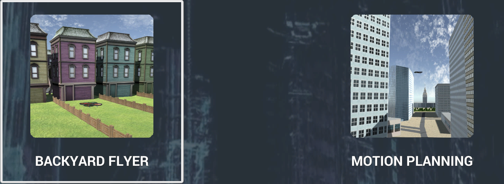
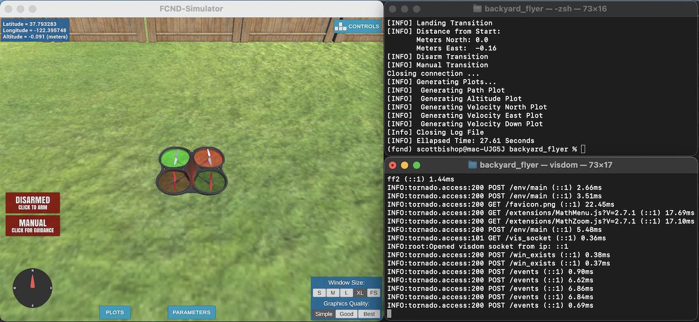
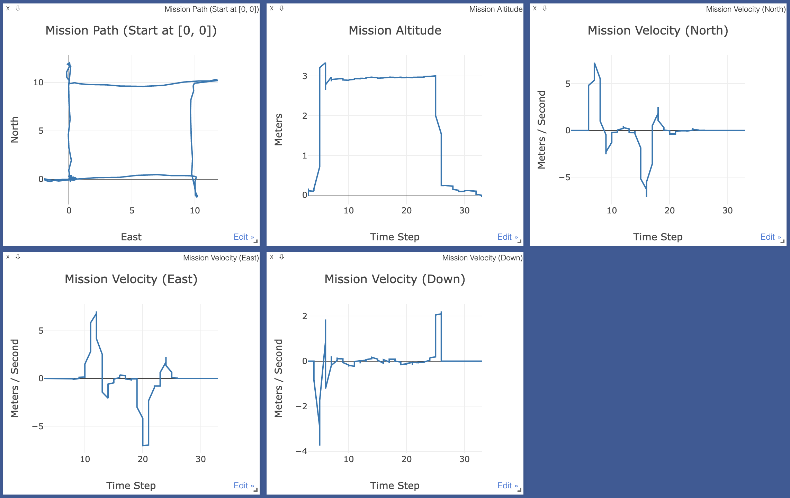

# Backyard Flyer

### **Environment Setup**

 

Download and unzip the [**Udacity Drone Simulator**](https://github.com/udacity/FCND-Simulator-Releases/releases) application. I personally place the application in the same directory as the parent folder that will house the cloned Git code (below). 
Then, install [**Anaconda**](https://www.anaconda.com/) or [**Miniconda**](https://docs.conda.io/en/latest/miniconda.html) (if either are not already installed).

 

Navigate to the folder you wish to store the project (ideally this folder would share the same directory as the **Udacity Drone Simulator** application) and execute the following commands in the terminal to download the project assets and change into the newly cloned assets folder:
<pre>
git clone https://github.com/udacity/FCND-Term1-Starter-Kit.git
cd FCND-Term1-Starter-Kit
</pre>

 

If you are setting up this environment for Windows you will need to run the following command as well:
<pre>
rename meta_windows_patch.yml meta.yml
</pre>

 

Then create and activate the **fcnd** environment by running the following code; this may take a few minutes:
<pre>
conda env create -f environment.yml
source activate fcnd
</pre>

 

The **backyard_flyer.py** script will also require the [**visdom**](https://github.com/fossasia/visdom) library in order to track the drone plan. By default the **backyard_flyer.py** script does not call **visdom**. **visdom** - and its **jsonpatch** dependency - can be installed by running the following in terminal:

<pre>
conda install -c conda-forge visdom
conda install -c conda-forge jsonpatch
</pre>

 

Finally, download this repository's **backyard_flyer.py** script and ensure it exists in the assets folder. The environment setup is complete!

 

### **Script Execution**

 

First, open the simulator application and select the **BACKYARD FLYER** option.

 

  

Next, open two terminals that both have the **fcnd** environment activated. In one terminal initialize the **visdom** server by running the following:

<pre>
visdom
</pre>

 

This will download any necessary scripts for **visdom** and output a message specifying the link for accessing the simulated drone's visualized flight plan in the browser. For me this access message appeared as follows:

<pre>
You can navigate to http://localhost:8097
</pre>

 

In the second terminal navigate to the assets folder - it should have the **backyard_flyer.py** script - and execute the following to have the simulated drone fly a box shape:

<pre>
python backyard_flyer.py --use_visdom true
</pre>

 

  

  

While the simulated drone flies the predefined box shape **visdom** will record the flight plan, which will be visualized on the server link page in your browser: mission path, mission altitude, mission velocity (north), mission velocity (east), mission velocity (down).

 

  

The **backyard_flyer.py** script has four parameters that can be passed when executing the script; one of the parameters (**use_visdom**) had been used in the example run command above. 

<pre>
python backyard_flyer.py --port --host --use_visdom --distance
</pre>

 

**port** and **host** typically will remain at their default values (**5760** and **127.0.0.1** respectively) as they are used to successfully establish the **MavlinkConnection**. **use_visdom** evidently adds metric information to the simulated drone's flight plan. The fourth parameter is **distance**; this dictates the distance in meters the simulated drone will travel along each edge of the planned square path. The default value is 10 meters.

 

From the **visdom** flight plan plots exhibited in the above image it is evident that the current, simulated drone overshoots its waypoints. Future work would be to mitigate how much the drone overshoots these waypoints by tracking its position and velocity in relation to the target location and adjust the thrust vector as would be necessary for a smoother waypoint arrival.

 

The [**API Documentation**](https://udacity.github.io/udacidrone/docs/drone-api.html) has more details about the **udacidrone** module used in the **backyard_flyer.py** script. More information on the **Drone** class and the provided API can be located in this [**GitHub**](https://github.com/udacity/udacidrone) repository.