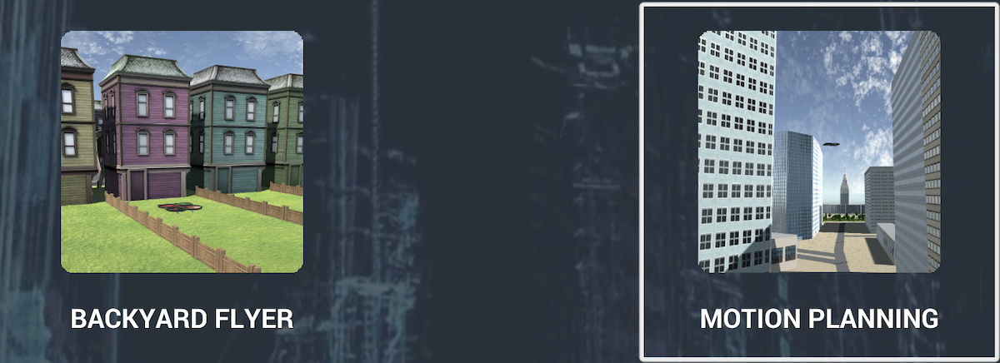

# Planning

### **Environment Setup**

 

Download and unzip the [**Udacity Drone Simulator**](https://github.com/udacity/FCND-Simulator-Releases/releases) application. I personally place the application in the same directory as the parent folder that will house the cloned Git code (below). 
Then, install [**Anaconda**](https://www.anaconda.com/) or [**Miniconda**](https://docs.conda.io/en/latest/miniconda.html) (if either are not already installed).

 

Navigate to the folder you wish to store the project (ideally this folder would share the same directory as the **Udacity Drone Simulator** application) and execute the following commands in the terminal to download the project assets and change into the newly cloned assets folder:
<pre>
git clone https://github.com/udacity/FCND-Motion-Planning
cd FCND-Motion-Planning
</pre>

 

Then create and activate the **fcnd** environment by running the following code; this may take a few minutes:
<pre>
conda env create -f environment.yml
source activate fcnd
</pre>

 

The **plan.py** script will also require the [**visdom**](https://github.com/fossasia/visdom) library in order to track the drone plan. By default the **plan.py** script does not call **visdom**. **visdom** - and its **jsonpatch** dependency - can be installed by running the following in terminal:

<pre>
conda install -c conda-forge visdom
conda install -c conda-forge jsonpatch
</pre>

 

Finally, download this repository's **plan.py** script and ensure it exists in the assets folder. The environment setup is complete!

 

### **Script Execution**

 

First, open the simulator application and select the **MOTION PLANNING** option.

 

  

Next, open two terminals that both have the **fcnd** environment activated. In one terminal initialize the **visdom** server by running the following:

<pre>
visdom
</pre>

 

This will download any necessary scripts for **visdom** and output a message specifying the link for accessing the simulated drone's visualized flight plan in the browser. For me this access message appeared as follows:

<pre>
You can navigate to http://localhost:8097
</pre>

 

In the second terminal navigate to the assets folder - it should have the **plan.py** script - and execute the following to have the simulated drone fly a box shape:

<pre>
python plan.py --use_visdom true
</pre>

 

  

  

While the simulated drone flies the path **visdom** will record the flight plan, which will be visualized on the server link page in your browser: mission path, mission altitude, mission velocity (north), mission velocity (east), mission velocity (down).

 

  

The **plan.py** script has five parameters that can be passed when executing the script; one of the parameters (**use_visdom**) had been used in the example run command above. 

<pre>
python plan.py --port --host --m_north --m_east --use_visdom
</pre>

 

**port** and **host** typically will remain at their default values (**5760** and **127.0.0.1** respectively) as they are used to successfully establish the **MavlinkConnection**. **use_visdom** evidently adds metric information to the simulated drone's flight plan. The last parameters are **m_north** and **m_east**, which dictate the distance in meters the simulated drone will travel north and east from the start location. The default value is 10 meters for both.

 

The [**API Documentation**](https://udacity.github.io/udacidrone/docs/drone-api.html) has more details about the **udacidrone** module used in the **plan.py** script. More information on the **Drone** class and the provided API can be located in this [**GitHub**](https://github.com/udacity/udacidrone) repository.

 

### **Future Work**

 

Currently the simulated drone builds its' plan using the $A^*$ algorithm. The latency to find an optimal plan is noticeable when the parameters **m_north** and **m_east** are set far from the start location. An update would be to implement something like a probabilistic roadmap or a receding horizon algorithm to allow the planning phase to run more efficiently.

 

The simulated drone overshoots each waypoint due to having too much velocity upon approach. The current implementation utilizes deadbands to allow the simulated drone to transition between waypoints more efficiently, but some additional approaches can be taken to ensure smoother waypoint arrivals. One approach would be the use of potential fields. Another approach would be to track its' position and velocity in relation to the target location and adjust the thrust vector as would be necessary.

 

Currently the simulated drone will disarm and terminate plan execution if the designated goal location is infeasible. When this occurs the following message will be printed to the console.

<pre>
[WARN] infeasible goal designated
</pre>

 

An update would be to check if the simulated drone could ascend to the necessary altitude of an object that currently causes a path to be infeasible. Currently the simulated drone's altitude is set to a static height of 20 meters and an object in the grid is represented as binary values; 0 if a space is feasible and 1 if the space contains an obstacle. This 2D map representation would need to be updated to a 2.5D map representation whereas obstacle cells are not labeled as 1, but rather as the obstacle's height + the simulated drone's safety distance.

 

Another update would be to allow the drone to plan a path using its' current location as the start location. Currently the drone uses the spawn/home location as the start location for path planning. This means if the same **m_north** and **m_east** designation is given twice the simulated drone will move to the goal the first time and then not move the second time; goals are relative to the spawn/home location. Ideally the simulated drone would set the goal for the second plan **m_north** and **m_east** meters away from the the goal point of the first plan.

 

### **Notes**

 

The **MOTION PLANNING** environment has a couple of bugs. These issues have been raised and acknowledged by the Udacity team, however at the time of this implementation these bugs have not been resolved.

First, the environment upon startup will render a stray building artifact on top of where the simulated drone spawns. When a plan navigates the simulated drone through the walls of this stray building artifact the simulated drone will register that as a collision and be slung across the map. The simulated drone will return back to the plan once it regains control, however sometimes the slung drone will lay in a position it cannot recover from. When this occurs it is best to exit the environment (press the **ESC** key) and reenter the environment.

Second, every other time the **MOTION PLANNING** environment is started up none of the obstacles will be rendered; the simulated drone will be sitting in an empty map. While the viewer may not see the obstacles, the simulated drone builds its' plan from the **colliders.csv** file, thus it should operate acceptably. While the user may not see the obstacles, the simulated drone will still consider those obstacles to be present.

 

It may be best to leverage this second bug, however. Without the stray building artifact interfering with the simulated drone's functionality the **plan.py** script may be able to run as intended.