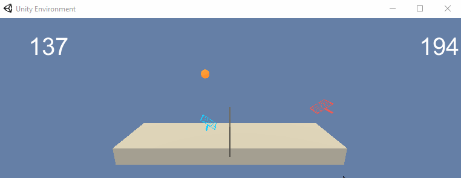

# Environment

The **Tennis.ipynb** script trains 2 agents to bounce a ball over a net. Each agent will receive a reward of **0.1** when the ball is successfully hit over the net and a reward of **-0.01** when the agent fails to hit the ball over the net. Thus the goal of each agent is to keep the ball in play. The environment is considered solved when the agents get an average score of **+0.5** over 100 consecutive episodes (taking the maximum over both agents for an episode)

 

  

Variable               | Definition
-----------------------|-------------------------------
**Observation Space**  | 8 variables corresponding to the position and velocity of the ball and racket.
**Action Space**       | 2 continuous actions corresponding to movement toward or away from the net and jumping.

  

# Installation

Before running the code cells within the **Tennis.ipynb** there are some dependencies that need to be handled first. Namely, 
- Ensuring the python environment matches the environment the code in this repository had been built around
- Ensuring that Open AI Gym and the necessary environments of the Gym are available
- Ensuring a precompiled learning environment is included; this precompiled environment circumnavigates the need to download Unity.

 

## Step I : Creating the **drl** Conda Environment

 

Create a new environment in Python 3.6 on Windows

<pre>
conda create --name drl python=3.6 
activate drl
</pre>

 

Create a new environment in Python 3.6 on Linux or Mac

<pre>
conda create --name drl python=3.6 
source activate drl
</pre>

 

## Step II : Minimum OpenAI Gym Install

 

Perform a minimum install of OpenAI Gym

<pre>
git clone https://github.com/openai/gym.git
cd gym
pip install -e .
</pre>

 

Install the classic control environment and the box2d environment

<pre>
pip install -e classic_control
pip install -e box2d
</pre>

 

## Step III : Clone Udacity Repository

 

Clone the following repository from Udacity

<pre>
git clone https://github.com/udacity/deep-reinforcement-learning.git
</pre>

 

Then, navigate to the following directory to install several dependencies (located in **requirements.txt**)

<pre>
cd deep-reinforcement-learning/python
pip install .
</pre>

 

**NOTE** At the time of this writeup there had been an issue with Windows 10 and the installation of **torch==0.4.0** within the **requirements.txt** file. If you run into an error for torch running the install command then follow along below. If there are no errors skip to **Step IV**

Within the newly cloned repository locate the **requirements.txt** file and comment / remove the torch installation dependency line. Now perform a pip install for torch manually.

### **Option I**

 

Run the following code in terminal if running a 10.2 CUDA-enabled Windows 10 64-Bit machine

<pre>
pip install torch==1.8.1+cu102 torchvision==0.9.1+cu102 torchaudio===0.8.1 -f https://download.pytorch.org/whl/torch_stable.html
</pre>

 

### **Option II**

 

Visit the [PyTorch Start Locally](https://pytorch.org/get-started/locally/) page and configure the pip install command to your machine's parameters. Copy and paste the auto-generated pip install command from the page into your terminal and run. Once torch has been added to your environment run the following lines below to install the other dependencies (assuming the command had not been run prior to this torch install workaround).

<pre>
pip install .
</pre>

 

The reason a pip install of torch is preferred over conda install could be due to this situation discussed [Here](https://github.com/pytorch/pytorch/issues/537#issuecomment-274275343). When running a call to CUDA (via initializing the **Agent** class) I noticed that the cell took forever to run. After performing a manual pip install the lag disappeared.  
  
Another step is to reinstall **numpy** as the manuall pip install of **torch** may return the following error

<pre>
ImportError: numpy.core.multiarray failed to import
</pre>

 

More info on this error is discussed [Here](https://github.com/pytorch/pytorch/issues/42441#issuecomment-729238603). So just run the following in the environment to reinstall Numpy; error should disappear after successful reinstall.

<pre>
conda install numpy --force-reinstall
</pre>

 

## Step IV : Create IPython Kernel

 

Now create an IPython Kernel for the newly created environment

<pre>
python -m ipykernel install --user --name drl --display-name "drl"
</pre>

 

## Step V : Download Precompiled Learning Environment

 

Now download the precompiled Unity Environment using one of the following links based on your machine.
- [Linux](https://s3-us-west-1.amazonaws.com/udacity-drlnd/P3/Tennis/Tennis_Linux.zip)
- [Mac OSX](https://s3-us-west-1.amazonaws.com/udacity-drlnd/P3/Tennis/Tennis.app.zip)
- [Windows 32 Bit](https://s3-us-west-1.amazonaws.com/udacity-drlnd/P3/Tennis/Tennis_Windows_x86.zip)
- [Windows 64 Bit](https://s3-us-west-1.amazonaws.com/udacity-drlnd/P3/Tennis/Tennis_Windows_x86_64.zip)

 

## Step VI : Obtain the Precompiled Unity Training Environment

 

Finally, locate the **p3_collab-compet** folder from the cloned Udacity repository and replace the **Tennis.ipynb** file with the file of the same name in this repository. This repository's file will contain a DDPG ([Deep Deterministic Policy Gradient](https://arxiv.org/pdf/1509.02971.pdf)) architecture that the agents will more intelligently learn from.

Once the **Tennis.ipynb** file has been replaced, you will need to place the unzipped Unity environment download (**Step V**) within that **p3_collab-compet** folder. The **Tennis.ipynb** script will train the agents and the Unity environment will serve as the environment the agents will train within.

  

# Training Agents

This section will assume the steps in the **Installation** section has been completed. Running the code in the **Tennis.ipynb** file to train the agents is straightforward. Before running cells make sure your kernel is set to the **drl** environment (created in **Step I** of the **Installation** section). Navigate to **Kernel -> Change Kernel -> drl**. You will know it is set correctly when the top-right kernel says **drl**. Shown below for reference.

 

 

The cells of the notebook will import necessary libraries; define the Actor, Critic, Noise, Replay Buffer, and Agent classes; initialize the environment and agent; define the **ddpg()** method used to train the agents; and finally train the agents and plot the results.

The **UnityEnvironment** is initialized by passing in the precompiled Unity training environment (downloaded and added in **Step V** and **Step VI** of the **Installation** section). This will open a Unity application window (empty for now) and output below the cell information relating to the environment. 

 

 

During the agents training you can navigate to the Unity application window (automatically created when initializating the environment) and watch the agents running through the episodes and learning!

 

 

Within the notebook you can monitor the score of the agents average score improve in realtime as it learns throughout the episodes! As the agents perform better the training will take longer since each episode (game) will go on for longer. In the GIF below you may notice toward the end of training the score become significantly better.

 

 

Within the **plot.ipynb** script the scores from training (this is the data saved after the **ddpg()** method call completes) will be plotted to show the learning rate of the the agents collectively. 

The example below shows that the implementation had been able to solve the environment (The environment is considered solved when the agents get an average score of **+0.5** over 100 consecutive episodes (taking the maximum over both agents for an episode)!

 

  