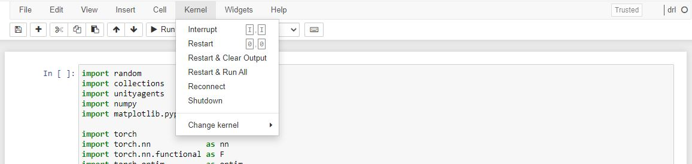
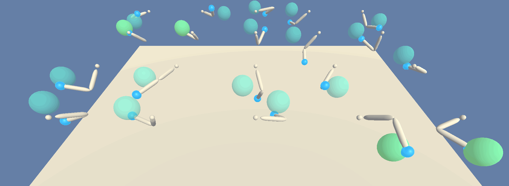

# **Environment**

 

The **01_train.ipynb** script trains agents to reach for target locations; each agent is represented as a double-jointed arm. Each agent will receive a reward of **+0.1** for each step that the agent's hand is in the goal location, thus each agent's goal is to maintain its position at the target location for as many time steps as possible. The environment is considered solved when all agent's can successfully maintain an average score of **+30** over 100 consecutive episodes.

 

  

Variable               | Definition
-----------------------|-------------------------------
**Observation Space**  | 33 variables corresponding to position, rotation, velocity, and angular velocities of the arm
**Action Space**       | Vector of 4 values corresponding to torque for each of the two joints; every value of this vector is a number between -1 and 1

  

# **Installation**

 

## **Step I: Creating the drl Conda Environment**

 

Create a new environment in Python 3.6:

<pre>
conda create --name drl python=3.6
source activate drl
</pre>

 

## **Step II: Minimum OpenAI Gym Install**

 

Perform a minimum install of OpenAI Gym:

<pre>
pip install gym
</pre>

 

Install the **classic_control** and **box2d** environments:

<pre>
conda install -c conda-forge gym-classic_control
conda install -c conda-forge gym-box2d
</pre>

 

## **Step III: Clone Udacity Repository**

 

Clone the following repository from Udacity:

<pre>
git clone https://github.com/udacity/deep-reinforcement-learning.git
</pre>

 

Navigate to the following directory to install several dependencies:

<pre>
cd deep-reinforcement-learning/python
pip install .
</pre>

 

At the time of this writeup there had been an issue with Windows 10 and the installation of **torch==0.4.0** within the **requirements.txt** file. If you run into an error for torch running the install command then follow along below. If there are no errors skip to **Step IV**. This procedure had been followed on OSX and there had not been any issues with package installations.

 

Within the newly cloned repository locate the **requirements.txt** file and comment / remove the torch installation dependency line. Now perform a pip install for torch manually.

 

### **Option I**

 

Run the following code in terminal if running a 10.2 CUDA-enabled Windows 10 64-Bit machine

<pre>
pip install torch==1.8.1+cu102 torchvision==0.9.1+cu102 torchaudio===0.8.1 -f https://download.pytorch.org/whl/torch_stable.html
</pre>

 

### **Option II**

 

Visit the [**PyTorch Start Locally**](https://pytorch.org/get-started/locally/) page and configure the pip install command to your machine's parameters. Copy and paste the auto-generated pip install command from the page into your terminal and run. Once torch has been added to your environment run the following lines below to install the other dependencies (assuming the command had not been run prior to this torch install workaround).

<pre>
pip install .
</pre>

 

The reason a pip install of torch is preferred over conda install could be due to this situation discussed [**Here**](https://github.com/pytorch/pytorch/issues/537#issuecomment-274275343). When running a call to CUDA (via initializing the **Agent** class) I noticed that the cell took forever to run. After performing a manual pip install the lag disappeared.  
  
Another step is to reinstall **numpy** as the manuall pip install of **torch** may return the following error

<pre>
ImportError: numpy.core.multiarray failed to import
</pre>

 

More info on this error is discussed [**Here**](https://github.com/pytorch/pytorch/issues/42441#issuecomment-729238603). So just run the following in the environment to reinstall Numpy; error should disappear after successful reinstall.

<pre>
conda install numpy --force-reinstall
</pre>

 

## **Step IV: Create IPython Kernel**

 

Now create an IPython Kernel for the newly created environment

<pre>
python -m ipykernel install --user --name drl --display-name "drl"
</pre>

 

## **Step V: Download Precompiled Learning Environment**

 

Now download the precompiled Unity Environment using one of the following links based on your machine.
- [Linux](https://s3-us-west-1.amazonaws.com/udacity-drlnd/P2/Reacher/Reacher_Linux.zip)
- [Mac OSX](https://s3-us-west-1.amazonaws.com/udacity-drlnd/P2/Reacher/Reacher.app.zip)
- [Windows 32 Bit](https://s3-us-west-1.amazonaws.com/udacity-drlnd/P2/Reacher/Reacher_Windows_x86.zip)
- [Windows 64 Bit](https://s3-us-west-1.amazonaws.com/udacity-drlnd/P2/Reacher/Reacher_Windows_x86_64.zip)

 

## Step VI : Obtain the Precompiled Unity Training Environment

 

Finally, locate and enter the **p2_continuous-control** folder from the cloned Udacity repository. Remove the **Continuous_Control.ipynb** file from that folder and add the following files from this repository:

- **01_train.ipynb**
- **Actor.py**
- **Agent.py**
- **Buffer.py**
- **config.py**
- **Critic.py**
- **utils.py**

Once the specified files are included, you will need to place the unzipped Unity environment download (**Step V**) within that **p2_continuous-control** folder. The **01_train.ipynb** script will train the agent and the Unity environment will serve as the environment the agent will train within.

  

# **Training**

This section will assume the steps in the **Installation** section has been completed. Running the code in the **01_train.ipynb** file to train the agents is straightforward. Before running cells make sure your kernel is set to the **drl** environment (created in **Step I** of the **Installation** section). Navigate to **Kernel -> Change Kernel -> drl**. You will know it is set correctly when the top-right kernel says **drl**. Shown below for reference.

 

 

Also, make sure the **file_name** parameter value in the **UnityEnvironment** method matches the filename of the Unity environment that had been downloaded and added in **Step V** and **Step VI** of the **Installation** section. For OSX as an example this value is **Reacher**.

 

Once the notebook is run a Unity application window will open automatically. During the agent training you can navigate to this Unity application window and watch a very fast view of the agents running through the episodes and learning.

 

  