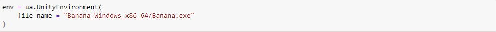

# Environment

 

The **Navigation.ipynb** script trains an agent to maximize the episodic environment reward by collecting the most yellow bananas (each yellow banana has a reward of **+1**) while avoiding the most blue bananas (failure to avoid a blue banana has a reward of **-1**). The environment is considered solved when the agent can successfully maintain an average reward of **+13** over 100 consecutive episodes.

 

  

This environment is similar to [Unity's ML Agent Food Collector](https://github.com/Unity-Technologies/ml-agents/blob/main/docs/Learning-Environment-Examples.md#food-collector) environment, however there are several differences

 

Bananas Environment                                | Unity's Food Collector Environment
---------------------------------------------------|-------------------------------
Collect yellow bananas and avoid blue bananas      | Collect green spheres and avoid red spheres 
Environment contains 1 agent                       | Environment contains 5 agents
37 values in observation space                     | 53 values in observation space
4 discrete actions: forward, backward, left, right | 3 continues actions (forward, side, rotation) and 1 discrete action (shoot laser or not)

 

This list of differences may not be an exhaustive list; check out Unity's GitHub page for the full details of the [Food Collector](https://github.com/Unity-Technologies/ml-agents/blob/main/docs/Learning-Environment-Examples.md#food-collector) environment.

  

# Installation

 

Before running the code cells within the **Navigation.ipynb** there are some dependencies that need to be handled first. Namely, 
- Ensuring the python environment matches the environment the code in this repository had been built around
- Ensuring that Open AI Gym and the necessary environments of the Gym are available
- Ensuring a precompiled learning environment is included; this precompiled environment circumnavigates the need to download Unity.

 

## Step I : Creating the **drl** Conda Environment

 

Create a new environment in Python 3.6 on Windows

<pre>
conda create --name drl python=3.6 
activate drl
</pre>

 

Create a new environment in Python 3.6 on Linux or Mac

<pre>
conda create --name drl python=3.6 
source activate drl
</pre>

 

## Step II : Minimum OpenAI Gym Install

 

Perform a minimum install of OpenAI Gym

<pre>
git clone https://github.com/openai/gym.git
cd gym
pip install -e .
</pre>

 

Install the classic control environment and the box2d environment

<pre>
pip install -e classic_control
pip install -e box2d
</pre>

 

## Step III : Clone Udacity Repository

 

Clone the following repository from Udacity

<pre>
git clone https://github.com/udacity/deep-reinforcement-learning.git
</pre>

 

Then, navigate to the following directory to install several dependencies (located in **requirements.txt**)

<pre>
cd deep-reinforcement-learning/python
pip install .
</pre>

 

**NOTE** At the time of this writeup there had been an issue with Windows 10 and the installation of **torch==0.4.0** within the **requirements.txt** file. If you run into an error for torch running the install command then follow along below. If there are no errors skip to **Step IV**. This procedure had been followed on OSX and there had not been any issues with package installations.

Within the newly cloned repository locate the **requirements.txt** file and comment / remove the torch installation dependency line. Now perform a pip install for torch manually.

### **Option I**

 

Run the following code in terminal if running a 10.2 CUDA-enabled Windows 10 64-Bit machine

<pre>
pip install torch==1.8.1+cu102 torchvision==0.9.1+cu102 torchaudio===0.8.1 -f https://download.pytorch.org/whl/torch_stable.html
</pre>

 

### **Option II**

 

Visit the [PyTorch Start Locally](https://pytorch.org/get-started/locally/) page and configure the pip install command to your machine's parameters. Copy and paste the auto-generated pip install command from the page into your terminal and run. Once torch has been added to your environment run the following lines below to install the other dependencies (assuming the command had not been run prior to this torch install workaround).

<pre>
pip install .
</pre>

 

The reason a pip install of torch is preferred over conda install could be due to this situation discussed [Here](https://github.com/pytorch/pytorch/issues/537#issuecomment-274275343). When running a call to CUDA (via initializing the **Agent** class) I noticed that the cell took forever to run. After performing a manual pip install the lag disappeared.  
  
Another step is to reinstall **numpy** as the manuall pip install of **torch** may return the following error

<pre>
ImportError: numpy.core.multiarray failed to import
</pre>

 

More info on this error is discussed [Here](https://github.com/pytorch/pytorch/issues/42441#issuecomment-729238603). So just run the following in the environment to reinstall Numpy; error should disappear after successful reinstall.

<pre>
conda install numpy --force-reinstall
</pre>

 

## Step IV : Create IPython Kernel

 

Now create an IPython Kernel for the newly created environment

<pre>
python -m ipykernel install --user --name drl --display-name "drl"
</pre>

 

## Step V : Download Precompiled Learning Environment

 

Now download the precompiled Unity Environment using one of the following links based on your machine.
- [Linux](https://s3-us-west-1.amazonaws.com/udacity-drlnd/P1/Banana/Banana_Linux.zip)
- [Mac OSX](https://s3-us-west-1.amazonaws.com/udacity-drlnd/P1/Banana/Banana.app.zip)
- [Windows 32 Bit](https://s3-us-west-1.amazonaws.com/udacity-drlnd/P1/Banana/Banana_Windows_x86.zip)
- [Windows 64 Bit](https://s3-us-west-1.amazonaws.com/udacity-drlnd/P1/Banana/Banana_Windows_x86_64.zip)

 

## Step VI : Obtain the Precompiled Unity Training Environment

 

Finally, locate the **p1_navigation** folder from the cloned Udacity repository and replace the **Navigation.ipynb** file with the file of the same name in this repository. This repository's file will contain a DQN network that an agent will more intelligently learn from.

Once the **Navigation.ipynb** file has been replaced, you will need to place the unzipped Unity environment download (**Step V**) within that **p1_navigation** folder. The **Navigation.ipynb** script will train the agent and the Unity environment will serve as the environment the agent will train within.

  

# Training Agent

 

This section will assume the steps in the **Installation** section has been completed. Running the code in the **Navigation.ipynb** file to train the agent is straightforward. Before running cells make sure your kernel is set to the **drl** environment (created in **Step I** of the **Installation** section). Navigate to **Kernel -> Change Kernel -> drl**. You will know it is set correctly when the top-right kernel says **drl**. Shown below for reference.

 

 

The first several cells of the notebook will import necessary libraries; define the classes for the Deep Q-Networks, Replay Buffer, and Agent, and define the **train()** method used to train the agent.

Following these sections you will initialize the **UnityEnvironment** by passing in the precompiled Unity training environment (downloaded and added in **Step V** and **Step VI** of the **Installation** section). This will open a Unity application window (empty for now) and output below the cell information relating to the environment.  Note that the **file_name** used in the image below is for a Windows machine; for OSX this value will be different.

 

 

Then, the next few cells will initialize additional variables that will give the Agent access to environment parameters during class initialization; specifically the size of the action and state space. Following the **Agent** class instance initialization the proceeding cell will train the agent by calling the **train()** method. The time for the training will depend on the hyperparameters and the machine the code is being run on. 

**NOTE** that the **train()** method sets the **train_mode** parameter to **True** by default; that is the method will train the agent using the Deep Q-Network. If you want, you could pass **False** for this parameter to have the agent instead naively wander the environment and not learn! Below is an example of what that will look like

 

 

During the agent training (**train_mode** is left as the default **True**) you can navigate to the Unity application window (automatically created when initializating the environment) and watch a very fast, first-person view of the agent running through the episodes and learning!

 

 

Within the notebook you can monitor the score of the agent's average reward for every 100 consecutive episodes in realtimeimprove as it learns throughout the episodes!

 

 

Lastly, the final cell will take the scores of training (this is the data returned after the **train()** method call completes) and plot the average score for each trained episode. An example of what this plot is shown below. 

The example below shows that the current agent implementation had been able to solve the environment. Rrecall that solved means the agent maintained an average reward of **+13** for 100 consecutive episodes.

 

